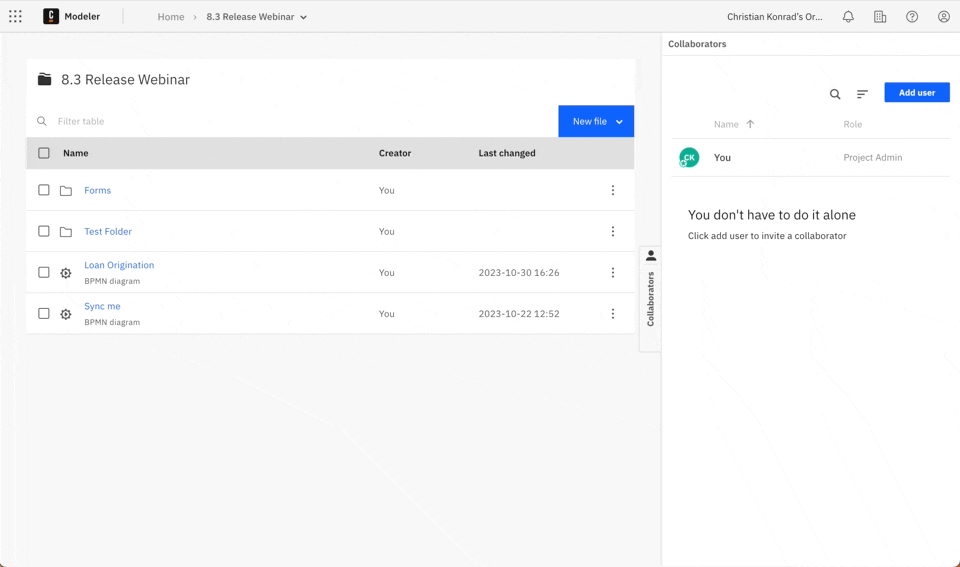

[](https://github.com/camunda-community-hub/community)
[](https://github.com/Camunda-Community-Hub/community/blob/main/extension-lifecycle.md#proof-of-concept-)
[](https://opensource.org/licenses/Apache-2.0)


# Web Modeler GitHub Sync Example

This repository contains a bash script `web-modeler-github-sync.sh` to be used as a starting point to explore how to sync a project from Web Modeler to GitHub.



## Why should I use it?

When you are looking to get started with the Web Modeler API to automate steps in your software development lifecycle, this is the right place for you. Use it as a template to automate your CI/CD by syncing Web Modeler projects to GitHub. 

## Setup

In the script `web-modeler-github-sync.sh`, you can find a set of variables at the top to be defined.

```sh
MODELER_CLIENT_ID=YOUR-ID
MODELER_CLIENT_SECRET=YOUR-KEY
GITHUB_TOKEN=YOUR-KEY

PROJECT_ID=YOUR-MODELER-PROJECT-ID
REPO_NAME=YOUR-REPOSITORY-NAME
GITHUB_USER_NAME=YOUR-USER-NAME
```

**Note:** The script was written for zsh on MacOS and is not guaranteed to work on Linux or other shells without adjustments.

